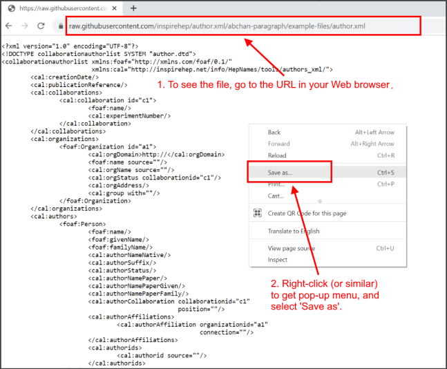
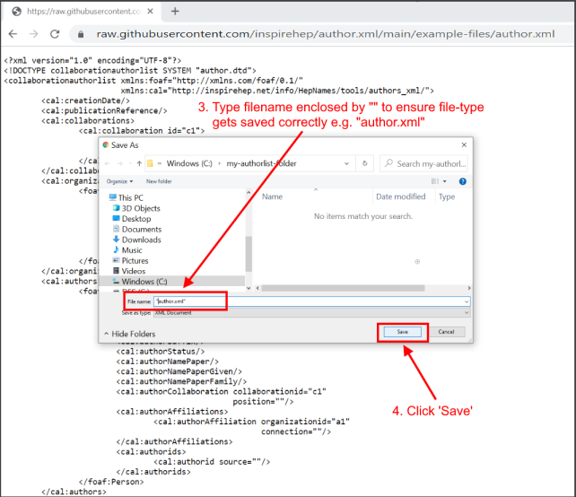
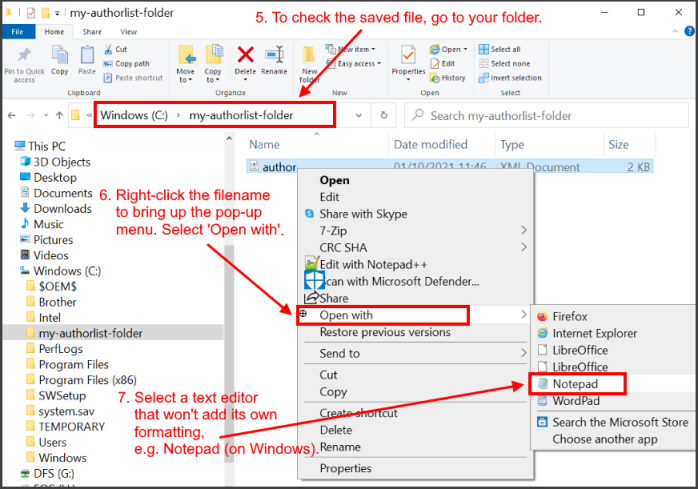
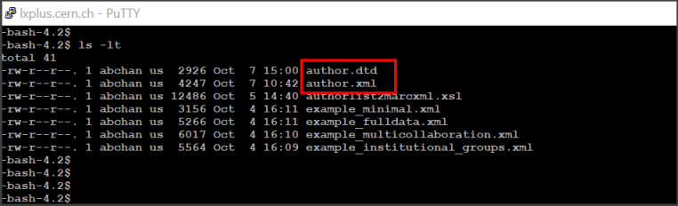
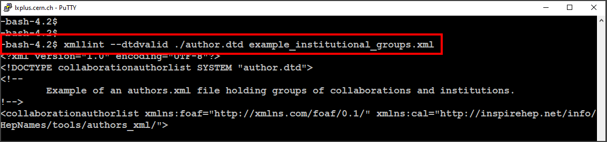
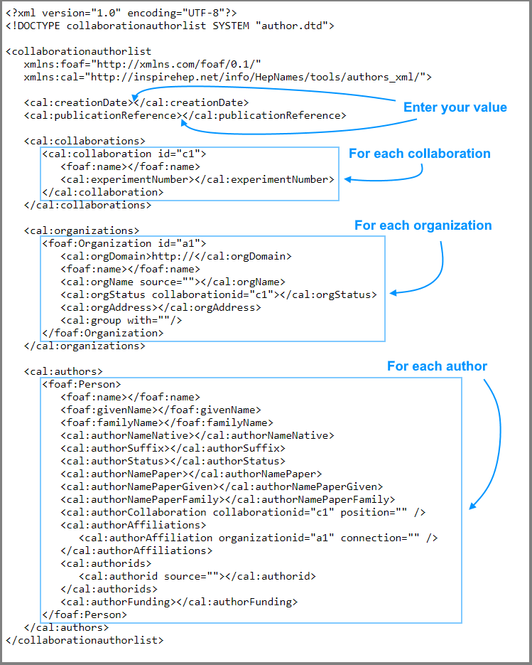
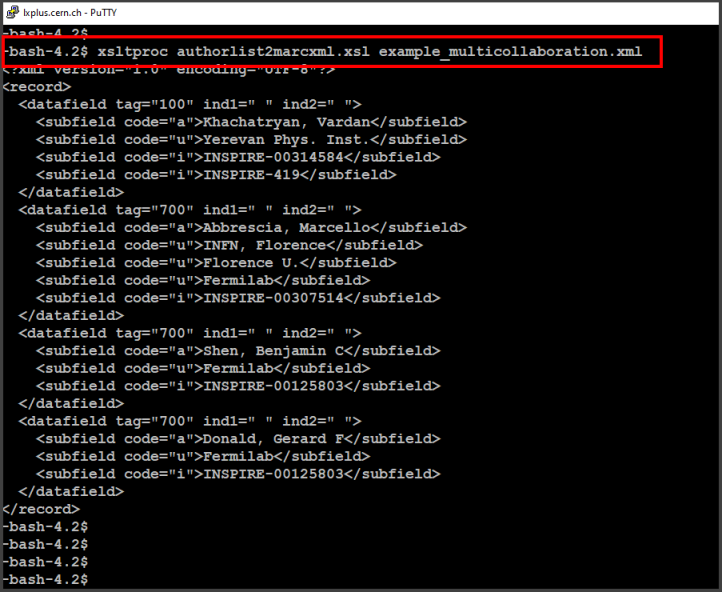

⚠️ **This documentation is still work-in-progress and shouldn't be relied on**

# INSPIRE Collaboration Author Lists
### The author.xml file - introduction, specification, creation
1. [Introduction](#introduction)    
    - [Background and motivation](#background)
    - [Partners in the author.xml project](#partners)
2. [Why an XML file for the author list?](#whyxml)
    - [What are the advantages of an author.xml file?](#whatadvantages)
    - [Which XML terms should I know before starting?](#knowterms)
3. [Examples of author.xml files](#examplefiles)
    - [How do I save the file to my folder?](#getauthorxml)
4. [**What do I need to do to produce my author.xml?**](#needtogetstarted)
    - [How do I get author.dtd and author.xml?](#getauthordtd)  
    - [How do I fill in the values in author.xml?](#howfillauthorxml)
    - [How do I validate my author.xml file?](#authorxmlvalidate)
    - [My author.xml is ready to be submitted to arXiv](#submitarxiv)
5. [Filling in author.xml file](#fillinauthorxml)    
    - [Template author.xml](#template)
    - [Explanation of data value fields in author.xml](#tablexmlelements) 
    - [Data values obtained elsewhere](#infoneeded)
6. [Can I convert my author.xml file to another format?](#authorxmlconvert)
7. [Who can I contact for assistance?](#contact)
8. [Links](#links)  


<a name="introduction"></a>
## Introduction

This user guide will help you to produce an author.xml file for the authors in your collaboration. Be sure to include the author.xml file with each submission to arXiv. Get on board so that authors get the appreciation and exposure they deserve!

<a name="background"></a>
### Background and motivation
Together, INSPIRE, the American Physical Society and arXiv.org have created a template file that you are recommended to use when you provide information about the authors for the submission of your paper. By utilizing unique ID's for authors and organizations (e.g. [INSPIRE ID](https://inspirehep.net/authors), [ORCID](https://orcid.org/), [ROR](https://ror.org/)), not only will your authors' information be precise and universally understood, but author information linking to professional information — affiliations, grants, publications, peer review, and more will get exposed. 

We recommend that when submitting your document, you also submit an authorlist file called author.xml. A template author.xml file is provided, see [What do I need to get started?](#needtogetstarted) Using this file as your guide, you fill in data value fields such as the authors' details, collaboration details, etc. Once completed and passed through a validator, the file is then deemed ready for submission. It is likely that you will submit your work to [arXiv.org](https://arxiv.org/).

Large collaborations with hundreds and even thousands of authors are already using the author.xml file to enable cataloguers and automated processes to glean complete, accurate information on authors. So, let's all be "on the same page" and ensure that **authors get recognition for their contributions**.

<a name="partners"></a>
### Partners in the author.xml project
**Information Services**

 - [arXiv.org](https://arxiv.org/)
 - [INSPIRE](https://inspirehep.net/)
 
**Publishers**  

 - [American Physical Society](https://journals.aps.org/)

**Collaborations**  

 - [ADAPT](https://inspirehep.net/experiments/1914484)
 - [ARA](https://inspirehep.net/experiments/1911572)
 - [Pierre Auger Observatory](https://www.auger.org/)
 - [Brookhaven STAR](https://www.star.bnl.gov/)
 - [CERN ALICE](https://alice-collaboration.web.cern.ch/)
 - [CERN ATLAS](https://atlas.cern/)
 - [CERN CMS](https://cms.cern/)
 - [CERN LHCb](https://lhcb-public.web.cern.ch/)
 - [CORSIKA 8](https://inspirehep.net/experiments/1891194)
 - [CTA](https://inspirehep.net/experiments/1339486)
 - [Daya Bay](http://dayabay.ihep.ac.cn/twiki/bin/view/Public/)
 - [DUNE](https://www.dunescience.org/)
 - [Fermilab CDF](https://www.fnal.gov/pub/tevatron/experiments/cdf.html)
 - [Fermilab D0](https://www.fnal.gov/pub/tevatron/experiments/dzero.html)
 - [Fermilab LArIAT](https://inspirehep.net/experiments/1297454) 
 - [Fermilab MicroBooNE](https://microboone.fnal.gov/)
 - [H1](https://inspirehep.net/experiments/1109080)
 - [IHEP BESIII](http://bes3.ihep.ac.cn/)
 - [JUNO](http://juno.ihep.cas.cn/)
 - [KEK T2K](https://t2k-experiment.org/)
 - [LiteBIRD](https://inspirehep.net/experiments/1923234)
 - [MAGIC](https://inspirehep.net/experiments/1110626)
 - [NEMESIS](https://inspirehep.net/experiments/1900553)
 - [NEMO](http://nemo.in2p3.fr/nemow3/)
 - [STRAW](https://inspirehep.net/experiments/1701337)
 - [ZEUS](https://www-zeus.desy.de/)

<a name="whyxml"></a>
## Why an XML file for the author list?
From [Background and motivation](#background), above, you will have gathered that the author list file, author.xml, uses the language XML.

XML stands for eXtensible Markup Language. Markup implies that there is information about the data structure i.e. your data (a.k.a. XML elements) will be enclosed between tags that describe what type of data it is. You should enter your data between the tags according to a specific format. 

The term 'eXtensible' means that we decide what the tags should be called - the tags in the author.xml have been defined and agreed upon, so don't go adding your own. 

XML was designed to store and transport data, and it is both human- and machine-readable. Note that XML files are data files, and that the information doesn't do anything on its own. However, the information will allow us to automate the process of publishing the document electronically, without the need for human intervention.

<a name="whatadvantages"></a>
### What are the advantages of the author.xml file?
These are the advantages of using an author.xml file when you submit your document:
 - Paper processing speed
 
Using an author.xml file allows INSPIRE to automatically add all authors and affiliations so that they show up in the database with minimal delay and with as few errors as possible.

 - Accurate author information and attribution of credit
 
The author.xml file, with all authors identified by an INSPIRE ID or ORCID number, will be used by publishers such as the APS in producing their journal articles. It will also be used by other database providers covering the scientific literature. Providing accurate information about the authors will result in more accurate publication lists and citation counts in addition to comprehensive search results.

 - Automatic generation
 
Given the XML file, an auto-generation process using xslt (stands for Extensible Stylesheet Language Transformations) can be used to generate the author list for the paper in the desired LaTeX format.
    
<a name="knowterms"></a>
### Which XML terms should I know before starting?
You don't need to know any specific terms. However, as you will come across the ones below we can touch on some of the XML-related terms that you might encounter.

 - **.xml** -> A .xml file is an eXtensible Markup Language** (XML) file. An XML file is just a plain text file containing information wrapped in tags. This information, called XML elements, is enclosed in meaningful, custom tags which describe the structure and other features of the document. **An xml file does not DO anything**. The file is used to store and transport data. 

 - **XML element** -> XML elements are the building blocks of an XML file. Elements can behave as containers to hold text, elements, attributes, media objects or all of these. For our purposes, we just need to know that XML elements are the data that we need to input.

 - **.dtd** -> DTD is an acronym for **Document Type Definition**. A .dtd file is a text file that specifies the rules governing the elements and attributes used in the corresponding XML document. This includes the order of the elements, the number of occurrences of each element, and finally the content and datatype of each element and attribute.

 - **Well formed XML document** -> An XML document is said to be well formed if it satifies the syntax rules. These rules are:
     - XML documents must have a root element (i.e. one sole parent element for all the XML elements in the document)
     - XML elements must have a start and end tag
     - XML tags are case sensitive
     - XML elements must be properly nested
     - XML attribute values must be quoted

 - **Valid XML Documents** -> A "well formed" XML document is not the same as a "valid" XML document.
 A "valid" XML document must already be well formed, but in addition, it must conform to a document type definition (the .dtd file). 
 With XML, errors in documents are not tolerated for the simple reason that XML processing programs are foreseen to be small and fast i.e the programs should not be doing error-checking and fixes.

<a name="examplefiles"></a>
## Examples of author.xml files
The links below go to individual example author.xml files. To save a copy in your own folder, go to each file and do save as "[filename].xml". We recommend that you save some of these files for browsing/testing later on. Picture instructions for saving a file that is displayed in your Web browser are at [How do I save the file to my folder?](#getauthorxml), just below.

[XML example - minimal file](https://raw.githubusercontent.com/inspirehep/author.xml/abchan-paragraph/example-files/example_minimal.xml)

[XML example - full-data file](https://raw.githubusercontent.com/inspirehep/author.xml/abchan-paragraph/example-files/example_fulldata.xml)

[XML example - multicollaboration file](https://raw.githubusercontent.com/inspirehep/author.xml/abchan-paragraph/example-files/example_multicollaboration.xml)

[XML example - institutional groups](https://raw.githubusercontent.com/inspirehep/author.xml/abchan-paragraph/example-files/example_institutional_groups.xml)

<a name="getauthorxml"></a>
### How do I save the file to my folder?
As an example, if you want to save the [author.xml file](https://raw.githubusercontent.com/inspirehep/author.xml/abchan-paragraph/example-files/author.xml) to your own folder, open the file in your Web browser. All Web browsers have a "Save as" option (try to right-click to get the pop-up menu), and you will be able to save the file. Below is our demo using Google Chrome Web browser on a Windows desktop:





<a name="needtogetstarted"></a>
## What do I need to do to produce my author.xml?
Let's go! You will need to: 
1. Get 2 files:
    1. author.xml (file for meta-data for the authors of your collaboration)
    1. author.dtd (rules file)
1. Fill in your values in the author.xml
1. Validate your author.xml against author.dtd

<a name="getauthordtd"></a>
### How do I get author.dtd and author.xml?
To get the template file author.xml, go to the [**author.xml file**](https://raw.githubusercontent.com/inspirehep/author.xml/abchan-paragraph/example-files/author.xml), and save "author.xml" to your own local folder. If necessary, follow the picture instructions at [How do I save the file to my folder?](#getauthorxml). 

To get the file author.dtd, go to the [**author.dtd file**](https://raw.githubusercontent.com/inspirehep/author.xml/abchan-paragraph/example-files/author.dtd), and save "author.dtd" to your own local folder. If necessary, you can do something similar to the picture instructions at [How do I save the file to my folder?](#getauthorxml). 

<a name="howfillauthorxml"></a>
### How do I fill in the values in author.xml?
For each author and collaboration, you should input the data values for the XML elements. A whole section is dedicated to the filling-in part, see [Filling in author.xml file](#fillinauthorxml) further down.

Some of the data values may have to be obtained from elsewhere. Go to [Data values obtained elsewhere](#infoneeded) to see how to get the ORCID identifier, collaboration ID, etc.

<a name="authorxmlvalidate"></a>
### How do I validate my author.xml?
After you have filled in all the data values of your author.xml, you should validate the file against the author.dtd file. Validation of your author.xml file is done in Linux.
Your directory needs to contain:
- your author.xml
- the given author.dtd



In the directory, run the command to validate your author.xml file against the author.dtd file:
```
 xmllint --dtdvalid ./author.dtd author.xml
```

#### An example of XML validation 
You can test an XML validation by using one of the example files. You need to be in a Linux directory, and run, for example: 
```
xmllint --dtdvalid ./author.dtd example_institutional_groups.xml
```
You can do a validation trial run by using one of the example files:


If the output contains 'fail' or 'error', then there is a problem with the .xml file, i.e. it is not adhering to the .dtd file. 

<a name="submitarxiv"></a>
## My author.xml is ready to be submitted to arXiv
Congratulations if your author.xml validated successfully!

Following validation, you can now submit the author.xml file as part of your submission to arXiv in a .tar ball. The instructions to do this are in [arxiv.org](https://arxiv.org/help/tar). 

Send an email to authors@inspirehep.net if you are stuck and need assistance.   


<a name="fillinauthorxml"></a>
## Filling in author.xml file
Your author.xml file should be filled in according to the descriptions of the template items listed below.

<a name="template"></a>
### Template author.xml
You should already have the author.xml template from [How do I get author.dtd and author.xml?](#getauthordtd)
The parts you will have to fill in are shown in the diagram that follows. For the data fields that you have to fill in, these are described underneath at [Explanation of data value fields in author.xml](#tablexmlelements). In some cases you will need to pick up values from another place, as described in [Data values obtained elsewhere](#infoneeded).
Keep in the mind the [Examples of author.xml files](examplefiles) as this will be a good guide for you. 



I want to go back up to ['How do I fill in the values in author.xml?'](#howfillauthorxml)

<a name="tablexmlelements"></a>
### Explanation of data value fields in author.xml
At the beginning of author.xml there is the XML declaration. This describes the version, encoding, and declares that this XML file will follow the rules in document type definition file author.dtd. The file 'author.dtd' needs to be in the same directory as the author.xml file. The root element and namespaces are also defined. [Additional information concerning the name spaces “cal” and “foaf”](#namespaceinfo) is available further down. Suffice to say here that these are used so as to group elements referring to similar properties. 

Do not modify the XML declaration:

```
<?xml version="1.0" encoding="UTF-8"?>
<!DOCTYPE collaborationauthorlist SYSTEM "author.dtd">
<collaborationauthorlist
   xmlns:foaf="http://xmlns.com/foaf/0.1/"
   xmlns:cal="http://inspirehep.net/info/HepNames/tools/authors_xml/">
```

**Here is what you need to do** - in your copy of author.xml enter **your value** for the element or attribute when you see **REQUIRED** or **OPTIONAL**, as described below. Keep the elements and attributes in the **exact order** as in the author.xml template - this will ensure that the XML will validate without warnings.   

+ Element `<cal:CreationDate>` **REQUIRED** - date of creation of this author.xml file
+ Element `<cal:publicationReference>` **REQUIRED**
    - an internal report number an arXiv number, or 
    - a collaboration’s internal document number, or
    - an ISBN, or
    - a DOI, or
    - a persistant web destination, or
    - anything that identifies the referenced document.
    If no immediate identifier, the title can be used
+ `<cal:collaborations>` is the container element holding container element(s) `<cal:collaboration>`.
    - `<cal:collaboration>` **REQUIRED** - container element with information about the collaboration.
        - Attribute `“id”`: OPTIONAL - is only needed if two (2) or more collaborations publish together. Typically, it is a letter+sequential number, starting at “c1”. 
        - Element `<foaf:name>`: **REQUIRED** - name of the collaboration. 
        - Element `<cal:experimentNumber>` OPTIONAL - number assigned by laboratory to the experiment, if present.
        - Element <`cal:group`> OPTIONAL - this value can be used for collaborations wishing to group institutions together
        - Attribute `“with”` OPTIONAL - you can specify which group. See [About groups](#aboutgroups) below. 

+ `<cal:organizations>` is the container element holding container element(s) `<foaf:Organization>`.
    - `<foaf:Organization>` **REQUIRED** - container element with information about an organization with which authors are affiliated. There may be one or more organizations within the <cal:organizations> container, and each organization is identified by the “id” attribute.
        - Attribute `“id”` **REQUIRED** - typically, it is a letter+sequential number, starting at “a1”, used to denote the author’s institution in this particular author.xml file so as to attach authors to the institution.
        - <a name="elementorgdomain"></a>Element <`cal:orgDomain`> OPTIONAL - internet domain of the institution. See [Identification of affiliations by their Internet domain](#orgdomain) below.
        - Element <`foaf:name`> **REQUIRED** this is the name of the organization as it will appear on the document.
        - Element <`cal:orgName`> OPTIONAL - this element also defines the name of the organization. Depending on where this name originates from, the source attribute can be used. The element content shall be only the name of the respective institute. Location information, if not part of the name, may be stated in the orgAddress element.
        - Attribute `“source”` OPTIONAL - (Defaults to “INTERNAL”) enables you to use the following for the institution’s name:
            - the INSPIRE (a.k.a. INSPIRE-ICN) form  
            - the ROR form 
            - your own INTERNAL form
        - Element `<cal:orgStatus>` OPTIONAL - status of the organization within the collaboration. Typically this would be either “member” or “nonmember.”
        - Attribute `“collaborationid”` OPTIONAL - enables you to specify which exact collaboration this organization is attached to. The collaboration is represented through its ID (e.g. “c1”). This element may be repeated if necessary.
        - Element <`cal:orgAddress`> OPTIONAL - full postal address of the institution as it would be written on a letter head.
        - Element <`cal:group`> OPTIONAL - this value can be used for collaborations wishing to group institutions together
        - Attribute `“with”` OPTIONAL - you can specify which group. See [About groups](#aboutgroups) below. 
       
+ `<cal:authors>` is the container element holding container element(s) `<foaf:Person>`.
    - `<foaf:Person>` **REQUIRED** - container element with information about the author. One or more authors reside within the <cal:authors> container.
        - Element `<foaf:name>` OPTIONAL - author's complete name written in the format e.g. "Johannes Diderik van der Waals".
        - Element `<cal:authorNameNative>` OPTIONAL - name of author as written in his or her native language e.g., "Ле́в Дави́дович Ланда́у" or "張晨光".
        - Element `<foaf:givenName>` OPTIONAL - all first/given names of an author in roman letters, e.g. "Johannes Diderik". You may leave this out in the rare case that a person does not possess a first name.
        - Element `<foaf:familyName>` **REQUIRED** - all sur/family names of an author in roman letters, e.g. "van der Waals".
        - Element `<cal:authorSuffix>` OPTIONAL - suffiix information for a name E.g. "Jr.", "Sr.", "III".
        - Element `<cal:authorStatus>` OPTIONAL - this element describes the vital status of an author. If the author is deceased, please state "Deceased". This element can be left empty.
        - Element `<cal:authorNamePaper>` **REQUIRED** - name of author as it appears on the title page of the paper, e.g. "J. van der Waals". This element supports Roman letters only.
        - Element `<cal:authorNamePaperGiven>` OPTIONAL - given name(s) of the author, as it appears on the title page of the paper, typically initials, e.g. "J." This element supports Roman letters only. As with <foaf:givenName>, it is "optional" in that someone may only have one name.
        - Element `<cal:authorNamePaperFamily>` OPTIONAL - family name of author as it appears on the title page of the paper, e.g. "van der Waals". This element supports Roman letters only.
        - Element `<cal:authorCollaboration>` **REQUIRED** - in a multi collaboration environment, the author can be attached to a collaboration with the appropriate collaboration ID. If the author is a member of more than one collaborations or has more than one position, this element may be repeated. 
        - Attribute `"collaborationid"` **REQUIRED** - (defaults to the first collaboration). Enables the specification of exactly which collaboration this author is attached to. The collaboration is represented through its ID (e.g. "c1").
        - Attribute `"position"` OPTIONAL - this attribute specifies the position of an author within the collaboration. This may be "Spokesperson", "Contact person", "Speaker" or "Editor".
        - `<cal:authorAffiliations>` is the container element holding element(s) `<cal:authorAffiliation>`.
            - Element `<cal:authorAffiliation>` OPTIONAL - this element connects the author to his or her institution, through the organization ID attribute. All affiliation elements (zero or more) reside within the <cal:authorAffiliations> container. Several affiliations may be mentioned by using several of these elements - one line for each affiliation. Please do not use a (comma-separated) list of organization identifiers in the 'organizationid' attribute. In cases where multiple affiliations resemble one entity, please mark the organizations with IDs e.g. "o1a", "o1b" and "o1c" to show their relation.
            - Attribute `"organizationid"` **REQUIRED** - connects with one of the organizations from above. The link is established by using the respective ID of the organization here (e.g. "a1").
            - Attribute `"connection"` OPTIONAL - (Defaults to "Affiliated with"). Here, you can list information about the connection such as "Affiliated with", "On leave from", "Also at" or "Visitor".
        - `<cal:authorids>` is the container element holding element(s) `<cal:authorid>`. 
            - Element `<cal:authorid>` OPTIONAL - this element specifies an ID number that identifies an author. If the author's ID is unknown, leave this element blank - do not use placeholder IDs, such as INSPIRE-0000000 or 0000-0000-0000-0000.
            - Attribute `"source"` **REQUIRED** - only if there is an authorID element present, specify the origins of the number. This can be: 
                - an INSPIRE ID number (source="INSPIRE"), or
                - a collaboration-internal ID (source="INTERNAL"), or 
                - other author ID services (e.g. source="ORCID"). 
                
              The [ORCID](https://orcid.org/) identifier is the highly reccommended author identifier to use - all authors are encouraged to sign up for this individually. If the author does not possess an ORCID identifier, an INSPIRE-ID may be used as an alternative. Please consult the section on [Where do I get the information needed for some of the data values?](#infoneeded) for more detailed information about the handling of author ids.
        - Element `<cal:authorFunding>` OPTIONAL - this element describes the author's funding source, such as a grant or fellowship, if necessary (e.g., Alfred P. Sloan Fellow). This element can be left empty.

<a name="aboutgroups"></a>
### About groups

Occassionally collaborations wish to group together institutions that form a consortium. 

In this particular case, the group is handled as just another institution and the institutions are connected together via the ID of this group, for example: 
`<cal:group with=”a1″ />`

Although intended for affiliations, typically united by some sort of funding arrangement, this element can be used to group collaborations and even authors.

The [XML example - institutional groups](https://raw.githubusercontent.com/inspirehep/author.xml/abchan-paragraph/example-files/example_institutional_groups.xml) shows groups of collaborations and institutions. In the example, there is: 
    - an Italian institution group`:
        - `<cal:group with="ai"/>`
    - a Canadian institution group:
        - `<cal:group with="aCanada"/>
 
The physicist 'John Quentin' is affiliated with the Canadian group as a whole:
`<cal:authorAffiliation organizationid="aCanada" connection="" />

while the physicist 'Maria Rossi' is affiliated with 2 of the 3 institutions in the Italian institution group:
'<cal:authorAffiliations>
            <cal:authorAffiliation organizationid="a1aa" connection="" />
            <cal:authorAffiliation organizationid="a1cc" connection="" />
         </cal:authorAffiliations>'

Where multiple institutions are treated as a single entity, in addition to using the element:

`<cal:group>`

it is helpful to use a set of IDs for them that plainly show their relationship, e.g.

```
<foaf:Organization id="a27a">
<foaf:Organization id="a27b">
<foaf:Organization id="a27c">
```

I want to go back up to ['Explanation of data value fields in author.xml'](#tablexmlelements)

<a name="infoneeded"></a>
## Data values obtained elsewhere
When filling in some of the XML elements in author.xml, you will need to refer to some information that is obtained somewhere else. 

### ORCID identifier
This is the 'gold standard' when it comes to researcher digital identification. This persistent digital identifier distinguishes a researcher from every other researcher, and while INSPIRE-IDs are author identifiers used internally by INSPIRE, **ORCIDs are used across disciplines, institutions, funders, research platforms, and publishers**.

Researchers are reccommended to use their [ORCID](https://orcid.org/) identifier. If they do not possess one, they should [**register for an ORCID**](https://orcid.org/register). This has to be done by the individual him/herself. 


After an author has obtained an ORCID, it is possible to connect this to his/her INSPIRE author profile at [Connecting ORCID to your INSPIRE author profile](https://inspirehep.net/help/knowledge-base/connect_orcid_author_profile/).

The ORCID identifier value is used to populate the element at: 

`<foaf:Person><cal:authorids><cal:authorid source="ORCID">`.

<a name="inspireidinline"></a>
### INSPIRE ID

As mentioned above, ORCID is the principal researcher digital identifier that authors are encouraged to use. 

In certain cases, however, for instance when authors are no longer actively publishing contributions, or when authors have passed away,  the INSPIRE-ID can be used. If any of your authors do not possess an ORCID, send the:

- author's name 
- author's email address

in an email to authors@inspirehep.net

so that we can manually generate an INSPIRE-ID, and that person's work will get it's due credit and exposure.

The value is used to populate the element: 

`<foaf:Person><cal:authorids><cal:authorid source="INSPIRE">` 

in author.xml.

Currently, the INSPIRE-ID is often quoted in conjunction with the ORCID in the author.xml file, for example:

```
<foaf:Person>
        :
        : 
        <cal:authorids>
            <cal:authorid source="INSPIRE">INSPIRE-00060668</cal:authorid>
            <cal:authorid source="ORCID">0000-0002-5888-2734</cal:authorid>
        </cal:authorids>
```

But having the ORCID is normally sufficient.

I want to go back up to ['Explanation of data value fields in author.xml'](#tablexmlelements)

### ROR
This is the unique identifier for every research organization in the world. Find an organization's identifier at:
[ROR](https://ror.org/). The value is used to populate the element at:

`<foaf:Organization><cal:orgDomain><foaf:name><cal:orgName source="ROR">`.

<a name="orgDomain"></a>
### Identification of affiliations by their Internet domain
This is for use with element at: 
`<foaf:Organization id=""><cal:orgDomain>`. 
Internet domains provide a unique, universally-understood way to list an institution. The hierarchical structure enables you to choose the required level of granularity, either at the institutional or departmental level. For example:
- damtp.cam.ac.uk – for the Department of Applied Mathematics and Theoretical Physics (DAMTP) at the University of Cambridge, or
- cam.ac.uk – for the University of Cambridge in general

The domain should be detailed enough to unambiguously determine the institution if there are distinct locations throughout the nation, e.g., pv.infn.it rather than just infn.it. If desired, this can go to the department/research-group level.

I want to back up to [Element <`cal:orgDomain`>](#elementorgdomain) in section 'Explanation of data value fields in author.xml'.

To validate your author.xml file, go back up to [How do I validate my author.xml file?](#authorxmlvalidate)

<a name=namespaceinfo></a>
### Additional information concerning the name spaces “cal” and “foaf”

XML namespaces differentiate between XML items with the same name, and also group XML data of the same type or function. XML Namespaces provide a method to avoid element name conflicts: so, despite both elements having 'xyz' in the following elements:
 1. `<cal:xyz>` 
 1. `<foaf:xyz>`

the 'xyz' are referring to completely different values. It is the prefixes 'cal' and 'foaf' that distinguish them from each other.  

“cal” is the official name space for ‘collaboration author lists’ as defined in this document.

“foaf” is a project creating a Web of machine-readable pages describing people, the links between them and the things they create and do. For building such an information system, standards have been created (For the creation of this document, the foaf vocabulary version 0.97 as of Jan. 1st 2010 is used). It stands for “friend of a friend” and is further described in the foaf specification and the [FOAF Project](http://www.foaf-project.org/) Web page.

I want to go back up to [Explanation of data value fields in author.xml](#tablexmlelements)

<a name="authorxmlconvert"></a>
## Can I convert my author.xml file to another format?
### Convert XML to MARCXML
Seeing your XML file formatted as MARCXML can help you see your data fields more easily. Get [authorlist2marcxml.xsl](https://raw.githubusercontent.com/inspirehep/author.xml/abchan-paragraph/example-files/authorlist2marcxml.xsl), save it to your directory on Linux, and run the command:
```
 xsltproc authorlist2marcxml.xsl [filename].xml
```
As an example, for file example_multicollaboration.xml:


<a name="contact"></a>
## Who can I contact for assistance?
Send an email to authors@inspirehep.net if you are stuck and need assistance. 
      
<a name="Links"></a>
## Links
 - [FOAF Project](http://www.foaf-project.org/)
 - [INSPIRE](https://inspirehep.net/)
 - [INSPIRE Authors](https://inspirehep.net/authors) (previously known as 'HEPNames')
 - [INSPIRE Institutions](https://inspirehep.net/institutions) (previously known as 'HEPInstitutes')
 - [ORCID](https://orcid.org/)
 - [ROR](https://ror.org/)


 

